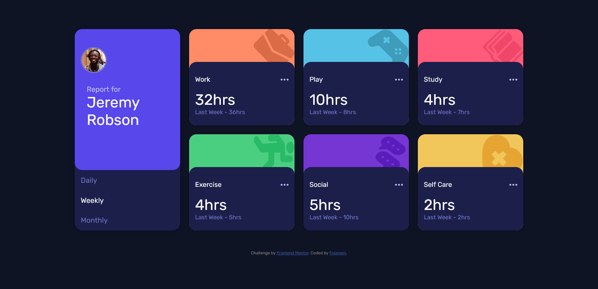
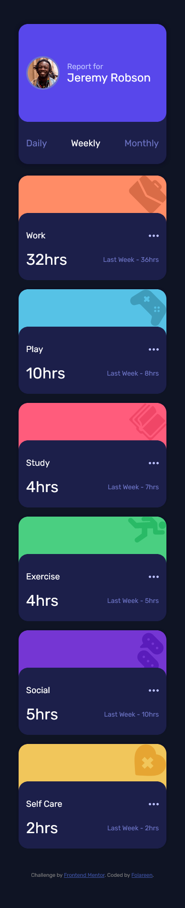

# Frontend Mentor - Time tracking dashboard solution

This is a solution to the [Time tracking dashboard challenge on Frontend Mentor](https://www.frontendmentor.io/challenges/time-tracking-dashboard-UIQ7167Jw). Frontend Mentor challenges help you improve your coding skills by building realistic projects. 

## Table of contents

- [Overview](#overview)
  - [The challenge](#the-challenge)
  - [Screenshot](#screenshot)
    -[desktop view](#desktop-view)
    -[mobile view](#mobile-view)
  - [Links](#links)
- [My process](#my-process)
  - [Built with](#built-with)
  - [What I learned](#what-i-learned)
  - [Continued development](#continued-development)
- [Author](#author)

## Overview

### The challenge

Users should be able to:

- View the optimal layout for the site depending on their device's screen size
- See hover states for all interactive elements on the page
- Switch between viewing Daily, Weekly, and Monthly stats

### Screenshot

#### desktop view

#### mobile view

### Links

- Solution URL: [My frontend mentor solution](https://www.frontendmentor.io/solutions/responsive-time-tracking-dashboard-using-css-grid-written-in-scss-Hyip7oiNq)
- Live Site URL: [https://time-tracking-dashboard1.netlify.app/](https://time-tracking-dashboard1.netlify.app/)

## My process

### Built with

- Semantic HTML5 markup
- SASS(SCSS)
- Flexbox
- CSS Grid
- Mobile-first workflow
- Async fetch of json file

### What I learned
I learned how to write scss and compile it to css. It was a very interesting process. Also practiced more on my css grid skills.
Learned how to work with json file by fetching with using async/await function.

## Author

- Frontend Mentor - [@folareen](https://www.frontendmentor.io/profile/folareen)
- Twitter - [@folareen](https://www.twitter.com/__folareen__)